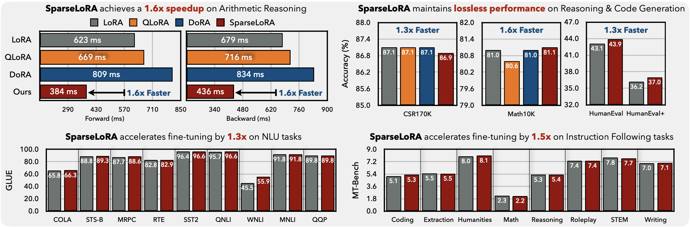
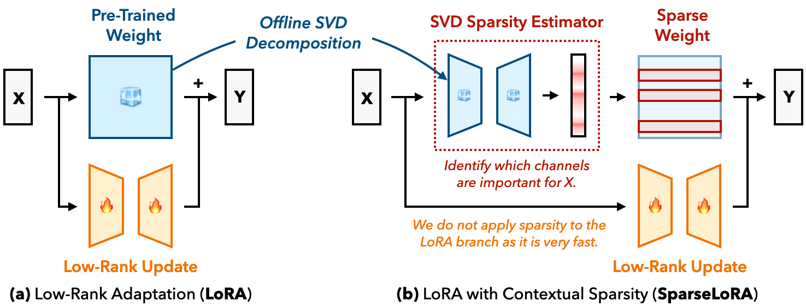

# SparseLoRA: Accelerating LLM Fine-Tuning with Contextual Sparsity
[[Paper](https://arxiv.org/abs/2506.16500)]
[[Project Page](https://z-lab.ai/projects/sparselora/)]
[[Slides](https://icml.cc/media/icml-2025/Slides/43493.pdf)]



## TL;DR
This paper introduces SparseLoRA, a method that uses contextual sparsity to accelerate LLM fine-tuning, cutting compute by up to $`\mathbf{2.2\times}`$ and runtime by $`\mathbf{1.6\times}`$ while maintaining model accuracy on reasoning, coding, and instruction-following tasks.

## Abstract
Fine-tuning LLMs is both computationally and memory-intensive. While parameter-efficient fine-tuning methods, such as QLoRA and DoRA, reduce the number of trainable parameters and lower memory usage, they do not decrease computational cost. In some cases, they may even slow down fine-tuning. In this paper, we introduce SparseLoRA, a method that accelerates LLM fine-tuning through contextual sparsity. We propose a lightweight, training-free SVD sparsity estimator that dynamically selects a sparse subset of weights for loss and gradient computation. Also, we systematically analyze and address sensitivity across layers, tokens, and training steps. Our experimental results show that SparseLoRA reduces computational cost by up to $`\mathbf{2.2\times}`$ and a measured speedup of up to $`\mathbf{1.6\times}`$ while maintaining accuracy across various downstream tasks, including commonsense and arithmetic reasoning, code generation, and instruction following.



## Installation and Usage

### Environment Setup
```bash
conda create -yn sparselora python=3.10
conda activate sparselora

bash scripts/setup/environment_setup.sh
```


## Quick Start for SparseLoRA
```python
from transformers import AutoModelForCausalLM, Trainer
from peft import get_peft_model, LoraConfig
from spft.api import SPFTConfig, get_spft_model

##* Load LoRA + LLM
model = get_peft_model(model: AutoModelForCausalLM, lora_cfg: LoraConfig)

##* Load Sparse Fine Tuning Config
spft_config = SPFTConfig.from_file("configs/sparsity/llama3-8b-math10k.yaml")

##* Apply SparseLoRA Patches (SVD sparsity estimator & liger-kernel optimizations)
model = get_spft_model(model, spft_config)

##* Launch Sparse Training:
trainer = Trainer(
    model=model,
    ...
)
trainer.train()
```

## Evaluation Benchmarks
In this work, we rigorously test the application of SparseLoRA to commonsense and arithmetic reasoning, natural language understanding, code generation, and instruction following. 

### Benchmark Configurations
Default benchmark arguments are set in `spft/train/args.py` with benchmark-specefic arguments specified under `configs/train/` including learning rate, batch size, etc. 

### Sparsity Configurations:
For all the below experiments, sparsity configurations are supplied to match our settings in the paper. A sample configuration `llama3-8b-math10k.yaml` appears as follows. Refer to `configs/sparsity/` for the complete set.

```yaml
#* General Settings
#! Step Offset: Controls the step at which sparsity is applied during fine-tuning, currently at 5%
start_step: 0.05 
# Specifies the sparsity predictor or selection strategy. For example, "svd_8" uses an SVD-based estimator with rank 8. Other options include "oracle_random_ffn", "oracle_l2norm", or "oracle_norm_ffn_attention_norm", which select weights based on different heuristics. The mode name is matched using a regex pattern to determine the sparsity method applied during training. Refer to "spft/modules/{base, attn, mlp}.py"
mode: "svd_8" 
# Specifies whether output tokens are processed densely (True) or sparsely (False) 
skip_output_tokens: True
# Naming converion used in creating the run-directory and wandb-streaming
ffn_sparsity: "ffn=0.99x28"
qkvo_sparsity: "qkv=0.75x14"

#* Layer-wise Sparsity
sparsity:
  layers.0.mlp: 0
  layers.0.self_attn: 0
  ...
  layers.29.mlp: 0.99
  layers.29.self_attn: 0.75
  layers.30.mlp: 0.99
  layers.30.self_attn: 0
  layers.31.mlp: 0
  layers.31.self_attn: 0
```

### SVD Sparsity Estimators:
Our existing evaluation benchmarks will automatically detect if the SVD predictors are missing and create them prior to launching any evaluations. This will only happen once per model. SVD Sparsity Estimators will be created at the requiste rank described in the sparsity configuration. Predictors will be stored at `spft/modules/low_rank_weights/`. Predictors can also be created with:

```bash
bash scripts/setup/predictor.sh {HF_MODEL_ID} {SPARSITY_CONFIG}
```
By default this will download the SVD predictors from our [HF page](https://huggingface.co/z-lab/sparselora-svd-estimator) if we have pre-computed them for the specific model `HF_MODEL_ID` and configuration `SPARSITY_CONFIG` else, they will be computed on your machine. Each model's SVD predictors at rank 8 only occupy about 30 Mb of space.


### Commonsense \& Arithmetic Reasoning
To run SparseLoRA on Commonsense and Arithmetic Reasoning benchmarks you can use:

```bash
bash scripts/csr170k.sh {HF_MODEL_ID} {SPARSITY_CONFIG}
bash scripts/math10k.sh {HF_MODEL_ID} {SPARSITY_CONFIG}
```

Datasets will be automatically downloaded to `./datasets`. To add extra arguments (e.g., for PEFT methods) or overide benchmark defaults, simply append them to the command:

```bash
bash scripts/math10k.sh "NousResearch/Meta-Llama-3-8B-Instruct" "llama3-8b-dense.yaml" --peft dora
```

### Natural Language Understanding (NLU): GLUE Benchmark:
To run SparseLoRA on the complete GLUE benchmark, you can use:

```bash
bash scripts/glue.sh
```

which will launch 5 seeds over the 9 GLUE benchmarks using `LLaMA3-8B-Instruct` with our prescribed sparsity configuration.

### Code Generation:
SparseLoRA can accelerate fine-tuning for code-generation models. We include examplar training on the CodeFeedback dataset. To use SparseLoRA, run:

```bash
bash scripts/codefeedback.sh "NousResearch/Meta-Llama-3.1-8B" "llama3.1-8b-codefeedback.yaml"
bash scripts/codefeedback.sh "NousResearch/Llama-2-7b-hf" "llama2-7b-codefeedback.yaml"
```

This script will launch the fine-tuning on the dataset, followed by inference (code-generation). Please ensure the `human-eval` package is installed correctly -- refer to [HumanEval](https://github.com/openai/human-eval?tab=readme-ov-file).

Upon conclusion, this script will generate a file, namely `generated_completions.jsonl` in the run directory. This includes the generated code that can be used for evaluation with [EvalPlus](https://github.com/evalplus/evalplus/tree/master).

We recommend you sanitize and synthetically check the code before running it via a docker container (refer to [EvalPlus](https://github.com/evalplus/evalplus/tree/master) for more information):

```bash
evalplus.sanitize --samples generated_completions.jsonl
evalplus.syncheck --samples generated_completions-sanitized.jsonl --dataset humaneval

docker run --rm --pull=always \
  -v $(pwd):/app \
  ganler/evalplus:latest \
  evalplus.evaluate --dataset humaneval \
  --samples /app/generated_completions-sanitized.jsonl
```

### Instruction Following:
SparseLoRA accelerates fine-tuning for complex instruction following. To sparsely train on WizardsLM dataset use:

```bash
bash scripts/wizardlm.sh "NousResearch/Meta-Llama-3.1-8B" "llama3.1-8b-wizardlm.yaml"
```

Upon completion, this script will save both the tokenizer and full model, which can be used with [FastChat](https://github.com/lm-sys/FastChat/tree/main) LLM-Judge implementation. 

After installing/setting up [FastChat](https://github.com/lm-sys/FastChat/tree/main). You may run the MT-Bench evaluation:

```bash
cd fastchat/llm_judge

python gen_model_answer.py --model-path {RUN_DIRECTORY} --model-id {UNIQUE_RUN_NAME} --num-gpus-total 8

export OPENAI_API_KEY= {YOUR_API_KEY}

#* Runs GPT-4 as Judge
python gen_judgment.py --model-list {UNIQUE_RUN_NAME} --parallel 4

python show_result.py
```

To obtain the category-wise results as reported in our paper, run the following script:

```bash
python tools/mt-bench.py --judgement {PATH_TO: fastchat/llm_judge/data/mt_bench/model_judgment/gpt-4_single.jsonl} --question {PATH_TO: fastchat/llm_judge/data/mt_bench/question.jsonl}
```

## Efficiency Benchmark:

### Engineering Optimization:
Beyond the main contribution of SparseLoRA, we heavily optimized the training pipeline to reduce overheads. This includes [LigerKernel](https://github.com/linkedin/Liger-Kernel) implementations, optimized residual-adds on the LoRA branch, and aggresssive fusion and inference optimizations on the SVD predictor. Please see `"spft/modules/{base, attn, mlp, pred}.py"`


### Speedup:
By default, the above fine-tuning cases will already exhibit speedup achieved through our SparseLoRA optimization. However to easily compare latency over a variety of methods, you may use our speedup script which will run the requisite training for 50 iterations with a 20 iteration warmup averaged over 5 indepdendent runs:

```bash
bash scripts/speedup.sh {HF_MODEL_ID} {SPARSITY_CONFIGURATION} {DATASET} 
```
A quick comparison can be executed with:
```bash
# LoRA
bash scripts/speedup.sh "NousResearch/Meta-Llama-3-8B-Instruct" "llama3-8b-dense.yaml" "math10k"

# DoRA
bash scripts/speedup.sh "NousResearch/Meta-Llama-3-8B-Instruct" "llama3-8b-dense.yaml"  "math10k" --peft dora

# SparseLoRA
bash scripts/speedup.sh "NousResearch/Meta-Llama-3-8B-Instruct" "llama3-8b-math10k.yaml" "math10k"
```

## PEFT Compatiblity
By default our method is compatible with existing PEFT strategies. Out of the box, we support running with LoRA (SparseLoRA) and SparseQLoRA

```bash
# SparseQLoRA
bash scripts/math10k.sh "NousResearch/Meta-Llama-3-8B-Instruct" "llama3-8b-math10k.yaml" --peft qlora
```

<h2>
  Integration with 
</h2>

SparseLoRA is designed to acclerate fine-tuning by contextually reducing the effective computation in each training step, meanwhile Unsloth leverages a variety of kernel fusions to reduce trainign overhead. As such, our method can be used to further acclerate Unsloth training. We provide an out of the box integration that can be installed and run as:

### Environment Setup
```bash
conda create -yn sparselora-unsloth python=3.10
conda activate sparselora-unsloth

bash scripts/setup/environment_setup.sh unsloth
```

### Unlsoth Training on CodeFeedback
```bash
bash scripts/codefeedback.sh "NousResearch/Meta-Llama-3.1-8B" "llama3.1-8b-codefeedback.yaml" --enable-unsloth True
```

Adding the `--enable-unsloth` argument works works on the reasoning, code generation, and instruction-following benchmarks. Be sure to checkout the default unsloth configurations under `spft/utils/model.py`. Alternatively our SparseLoRA/Unsloth compatible autograd functions (`spft/modules/unlsoth/*`) can be used out of place.

## Citation
If you find SparseLoRA useful or relevant to your project and research, please kindly cite our paper:

```bibtex
@inproceedings{khaki2025sparselora,
  title = {SparseLoRA: Accelerating LLM Fine-Tuning with Contextual Sparsity},
  author = {Khaki, Samir and Li, Xiuyu and Guo, Junxian and Zhu, Ligeng and Plataniotis, Konstantinos N and Yazdanbakhsh, Amir and Keutzer, Kurt and Han, Song and Liu, Zhijian},
  booktitle = {International Conference on Machine Learning (ICML)},
  year = {2025}
}
```